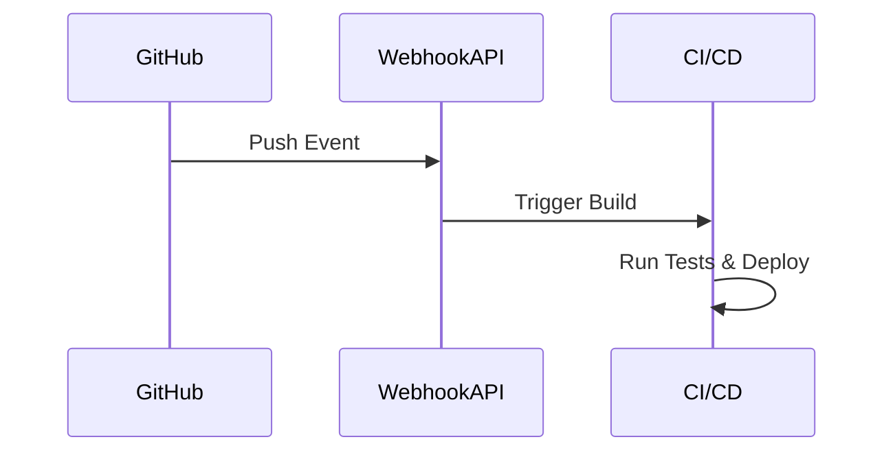

# 🚀 WebhookSolution

[](https://dotnet.microsoft.com/download)
[](LICENSE)
[](https://blog.cleancoder.com/uncle-bob/2012/08/13/the-clean-architecture.html)
[](https://en.wikipedia.org/wiki/SOLID)

Un sistema robusto y extensible para recibir y procesar webhooks, desarrollado con **Clean Architecture** y principios **SOLID**.

## 📋 Tabla de Contenidos

- [Características](#-características)
- [Arquitectura](#-arquitectura)
- [Tecnologías](#-tecnologías)
- [Instalación](#-instalación)
- [Uso](#-uso)
- [API Reference](#-api-reference)
- [Estructura del Proyecto](#-estructura-del-proyecto)
- [Ejemplos](#-ejemplos)
- [Extensibilidad](#-extensibilidad)
- [Contribución](#-contribución)

## ✨ Características

- 🎯 **Recepción de Webhooks**: Endpoint REST para recibir notificaciones HTTP
- 🏗️ **Clean Architecture**: Separación clara de responsabilidades
- 💉 **Dependency Injection**: Inyección de dependencias nativa de .NET
- 🔧 **Extensible**: Fácil agregar nuevos tipos de manejadores
- ✅ **SOLID Principles**: Implementación completa de principios SOLID
- 📚 **Swagger Integration**: Documentación automática de la API
- 🛡️ **Validación Robusta**: Validación de entrada y manejo de errores
- ⚡ **Asíncrono**: Procesamiento asíncrono de eventos

## 🏗️ Arquitectura

Este proyecto implementa **Clean Architecture** con las siguientes capas:

```
┌─────────────────────────────────────────────────────────┐
│                    Presentation                         │
│                  (Webhook.API)                          │
├─────────────────────────────────────────────────────────┤
│                    Application                          │
│                (Webhook.Application)                    │
├─────────────────────────────────────────────────────────┤
│                      Domain                             │
│                 (Webhook.Domain)                        │
├─────────────────────────────────────────────────────────┤
│                  Infrastructure                         │
│               (Webhook.Infrastructure)                  │
├─────────────────────────────────────────────────────────┤
│                     Shared                              │
│                 (Webhook.Shared)                        │
└─────────────────────────────────────────────────────────┘
```

### Principios SOLID Implementados

- ✅ **Single Responsibility**: Cada clase tiene una única responsabilidad
- ✅ **Open/Closed**: Abierto para extensión, cerrado para modificación
- ✅ **Liskov Substitution**: Las implementaciones son intercambiables
- ✅ **Interface Segregation**: Interfaces específicas y cohesivas
- ✅ **Dependency Inversion**: Dependencias de abstracciones, no concreciones

## 🛠️ Tecnologías

- **.NET 8** - Framework principal
- **ASP.NET Core** - API REST
- **Swagger/OpenAPI** - Documentación de la API
- **C# 12** - Lenguaje de programación

## 🚀 Instalación

### Prerrequisitos

- [.NET 8 SDK](https://dotnet.microsoft.com/download/dotnet/8.0)
- IDE (Visual Studio 2022, VS Code, Rider)

### Clonar el Repositorio

```bash
git clone https://github.com/harlericho/WebhookSolution.git
cd WebhookSolution
```

### Restaurar Dependencias

```bash
dotnet restore
```

### Ejecutar el Proyecto

```bash
dotnet run --project Webhook.API
```

La API estará disponible en:

- **HTTPS**: `https://localhost:7000`
- **HTTP**: `http://localhost:5000`
- **Swagger UI**: `https://localhost:7000/swagger`

## 💻 Uso

### Enviar un Webhook

```bash
curl -X POST https://localhost:7000/api/webhook \
  -H "Content-Type: application/json" \
  -d '{
    "tipoEvento": "push",
    "carga": "Usuario realizó push al repositorio main"
  }'
```

### Respuesta Exitosa

```json
{
  "message": "Evento procesado correctamente."
}
```

## 📖 API Reference

### POST /api/webhook

Recibe y procesa un evento de webhook.

**Request Body:**

```json
{
  "tipoEvento": "string",
  "carga": "string"
}
```

**Responses:**

- `200 OK`: Evento procesado correctamente
- `400 Bad Request`: Datos inválidos
- `500 Internal Server Error`: Error interno del servidor

## 📁 Estructura del Proyecto

```
WebhookSolution/
├── Webhook.API/                    # 🎯 Capa de Presentación
│   ├── Controllers/
│   │   ├── WebhookController.cs    # Controlador principal
│   │   └── WeatherForecastController.cs
│   ├── Program.cs                  # Configuración de la aplicación
│   └── appsettings.json
├── Webhook.Application/            # 🔧 Capa de Aplicación
│   └── ProcessWebhookUseCase.cs    # Caso de uso principal
├── Webhook.Domain/                 # 💎 Capa de Dominio
│   ├── Entities/
│   │   └── WebhookEvent.cs         # Entidad de dominio
│   └── Interfaces/
│       └── IWebhookHandler.cs      # Contrato del manejador
├── Webhook.Infrastructure/         # 🔌 Capa de Infraestructura
│   └── DefaultWebhookHandler.cs    # Implementación por defecto
├── Webhook.Shared/                 # 📦 Elementos Compartidos
│   └── EventTypes.cs               # Constantes de tipos de eventos
└── WebhookSolution.sln
```

## 🎯 Ejemplos

### Ejemplo con GitHub Webhook

```json
{
  "tipoEvento": "push",
  "carga": "{\"ref\":\"refs/heads/main\",\"commits\":[{\"message\":\"Fix bug\"}]}"
}
```

### Ejemplo con GitLab Webhook

```json
{
  "tipoEvento": "merge_request",
  "carga": "{\"object_kind\":\"merge_request\",\"action\":\"open\"}"
}
```

### Tipos de Eventos Soportados

- `push` - Eventos de push a repositorios
- `ping` - Eventos de prueba/ping
- Extensible para cualquier tipo personalizado

## 🔧 Extensibilidad

### Crear un Nuevo Manejador

```csharp
public class EmailWebhookHandler : IWebhookHandler
{
    public async Task HandleAsync(WebhookEvent webhookEvent)
    {
        // Enviar email con los detalles del evento
        await SendEmailAsync(webhookEvent);
    }
}
```

### Registrar el Nuevo Manejador

```csharp
// En Program.cs
builder.Services.AddScoped<IWebhookHandler, EmailWebhookHandler>();
```

### Agregar Nuevos Tipos de Eventos

```csharp
// En EventTypes.cs
public const string PullRequest = "pull_request";
public const string Issue = "issue";
public const string Release = "release";
```

## 🧪 Testing

```bash
# Ejecutar todos los tests
dotnet test

# Ejecutar tests con cobertura
dotnet test --collect:"XPlat Code Coverage"
```

## 🏃‍♂️ Casos de Uso

### Integración con CI/CD



### Notificaciones

- 📧 **Email**: Notificar cambios por email
- 💬 **Slack/Teams**: Publicar en canales de chat
- 📱 **Push Notifications**: Alertas móviles

### Automatización

- 🚀 **Deployments**: Disparar despliegues automáticos
- 📊 **Analytics**: Registrar métricas de actividad
- 🔄 **Sincronización**: Actualizar sistemas externos

## 🤝 Contribución

1. Fork el proyecto
2. Crea una rama para tu feature (`git checkout -b feature/AmazingFeature`)
3. Commit tus cambios (`git commit -m 'Add some AmazingFeature'`)
4. Push a la rama (`git push origin feature/AmazingFeature`)
5. Abre un Pull Request

## 📄 Licencia

Este proyecto está bajo la Licencia MIT - mira el archivo [LICENSE](LICENSE) para más detalles.

## 👤 Autor

**harlericho**

- GitHub: [@harlericho](https://github.com/harlericho)

## 🙏 Agradecimientos

- Inspirado en los principios de Clean Architecture de Robert C. Martin
- Implementación de patrones SOLID
- Comunidad .NET por las mejores prácticas

---

⭐ **¡Si te gusta este proyecto, dale una estrella!** ⭐
